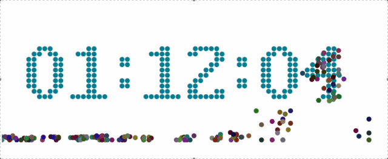

# 简介
使用canvas写的时钟

### 页面效果


### 使用文档
```
npm i canvas-clock
yarn add canvas-clock
```
```js
import CanvasClock from 'canvas-clock';
```

```js
new CanvasClock({
  el: "#canvas", // 必传
  color: 'red' 
});
```
